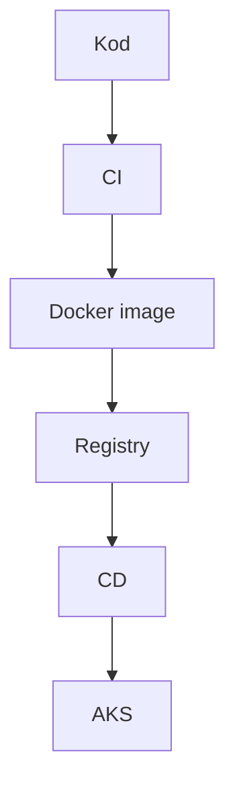

# Laboratorium: GitHub Actions & Microsoft Azure (CI/CD)

Witaj na laboratorium z automatyzacji procesów DevOps! Twoim celem na dzisiejszych zajęciach jest zbudowanie w pełni zautomatyzowanego rurociągu (pipeline), który przetestuje kod, zbuduje obraz Docker, powoła infrastrukturę w Azure za pomocą Terraforma, a na końcu wdroży aplikację na klaster Kubernetes. 

**Narzędzia, których będziesz używać:**
* Konto GitHub (GitHub Actions, GitHub Container Registry)
* Visual Studio Code (VS Code) i GitHub Desktop (do pracy z kodem)
* **Azure Cloud Shell** (wbudowana konsola w portalu Azure – do wykonywania poleceń chmurowych bez lokalnej konfiguracji)

---

## Zadanie 1: Inicjalizacja izolowanego potoku (GitHub)

Zaczynamy od napisania najprostszego potoku, aby poznać składnię YAML i architekturę GitHub Actions. Zadanie to wykonamy w całości na platformie GitHub.

**Kroki do wykonania:**
1. Zaloguj się na swoje konto na GitHubie.
2. Stwórz nowe, **publiczne** repozytorium o nazwie `numerindeksu-lab-gha`.
3. Sklonuj repozytorium na swój komputer przy użyciu **GitHub Desktop** i otwórz je w **VS Code**.
4. W głównym katalogu repozytorium utwórz foldery: `.github/workflows/` (zwróć uwagę na kropkę na początku `.github`!).
5. Wewnątrz folderu `workflows` utwórz plik `task1-hello.yml` i wklej do niego kod z Zadania 1.
6. Zapisz plik, użyj GitHub Desktop, aby zrobić **Commit** i naciśnij **Push origin**.
7. Wejdź na stronę swojego repozytorium na GitHubie, przejdź do zakładki **Actions**.
8. Zobaczysz swój potok z lewej strony. Kliknij go i użyj przycisku **Run workflow** (ponieważ użyliśmy triggera `workflow_dispatch`).
9. Zaobserwuj, jak GitHub przydziela maszynę (Ubuntu) i wykonuje Twoje kroki.

---

## Zadanie 2: Implementacja dynamicznych mechanizmów wielowariantowych

W tym zadaniu wykorzystamy zaawansowane mechanizmy: graf zależności (`needs`), matrycę (`strategy.matrix`) oraz przesyłanie danych pomiędzy odizolowanymi maszynami (`$GITHUB_OUTPUT`).

**Kroki do wykonania:**
1. W folderze `.github/workflows/` utwórz plik `task2-matrix.yml` i skopiuj do niego przygotowany kod.
2. Przeanalizuj komentarze w kodzie. Zauważ, że `Zadanie_B` uruchomi się automatycznie w 3 równoległych wariantach dla różnych systemów operacyjnych.
3. Zrób Commit i Push.
4. Uruchom workflow w zakładce **Actions** i sprawdź logi z `Zadanie_B`, aby zobaczyć wartość przekazaną z `Zadanie_A`.

---

## Zadanie 3: Uniezależnienie tożsamości i uwierzytelnianie potoku w Azure

Aby GitHub mógł cokolwiek zrobić w chmurze Azure (np. powołać infrastrukturę), musi się autoryzować. Tworzymy tzw. **Service Principal** (Konto Serwisowe).

*Zamiast logować się lokalnie w terminalu, zrobimy to szybciej w chmurze!*

**Kroki do wykonania:**
1. Otwórz portal Azure w przeglądarce i uruchom **Azure Cloud Shell** (ikonka terminala na górnym pasku, wybierz Bash).
2. Zmodyfikuj dwie pierwsze linijki poniższego skryptu, wpisując swój dokładny login GitHub oraz nazwę repozytorium (uwaga na wielkość liter!), a także nazwę brancha, na którym będą wywoływane Github Actions, a następnie wklej i uruchom całość w terminalu:

```bash
GITHUB_USER="TwójLoginGitHub"
GITHUB_REPO="NazwaTwojegoRepozytorium"
GITHUB_BRANCH="NazwaGlownegoBrancha"

# 1. Tworzenie grupy zasobów dla tożsamości
az group create --name RG-GitHub-Auth --location polandcentral


# 2. Tworzenie Tożsamości Zarządzanej (To omija blokady uczelniane!)
az identity create --name GHA-Identity --resource-group RG-GitHub-Auth

# 3. Pobranie danych do zmiennych
SUB_ID=$(az account show --query id -o tsv)
CLIENT_ID=$(az identity show --name GHA-Identity --resource-group RG-GitHub-Auth --query clientId -o tsv)
TENANT_ID=$(az account show --query tenantId -o tsv)

echo "Czekam 20 sekund na replikację tożsamości w Azure..."
sleep 20

# 4. Nadanie tożsamości uprawnień (Contributor) do Twojej subskrypcji
az role assignment create --role contributor --assignee $CLIENT_ID --scope /subscriptions/$SUB_ID

echo "Dodatkowy sleep 5 sekund..."
sleep 5

# 5. Konfiguracja Federacji OIDC (Powiązanie tożsamości z Twoim repozytorium na GitHubie)
az identity federated-credential create \
  --name GitHub-Federation-Main \
  --identity-name GHA-Identity \
  --resource-group RG-GitHub-Auth \
  --issuer https://token.actions.githubusercontent.com \
  --subject repo:$GITHUB_USER/$GITHUB_REPO:ref:refs/heads/$GITHUB_BRANCH \
  --audiences api://AzureADTokenExchange

# 6. Wypisanie danych końcowych
echo "========================================="
echo "DODAJ TE 3 WARTOŚCI JAKO SECRETY W GITHUBIE:"
echo "AZURE_CLIENT_ID: $CLIENT_ID"
echo "AZURE_TENANT_ID: $TENANT_ID"
echo "AZURE_SUBSCRIPTION_ID: $SUB_ID"
echo "========================================="

```
 3. Skrypt zwróci Ci na końcu 3 ciągi znaków.
 4. Przejdź na GitHuba -> **Settings** -> **Secrets and variables** -> **Actions**.
 5. Dodaj 3 nowe sekrety (New repository secret). Ich nazwy muszą być dokładnie takie jak wyżej: AZURE_CLIENT_ID, AZURE_TENANT_ID oraz AZURE_SUBSCRIPTION_ID, a w polach Secret wklej odpowiadające im wygenerowane ciągi.

---

## Zadanie 4: Publikacja artefaktów aplikacyjnych (GHCR)

Zbudujemy obraz Docker z prostą aplikacją i wrzucimy go do darmowego rejestru wbudowanego w GitHuba (GitHub Container Registry). 

*Pamiętaj o różnicy między Magazynem a Serwerem! W tym kroku aplikacja nie zostanie nigdzie uruchomiona. Obraz to tylko "przepis" zapakowany w cyfrową paczkę, która odkładana jest na półkę w magazynie (GHCR).*

**Kroki do wykonania:**
1. W głównym folderze repozytorium utwórz folder `src`. 
2. W folderze `src` utwórz dwa pliki: skrypt `app.py` oraz `Dockerfile`.
3. W folderze `.github/workflows/` utwórz plik `task4-docker.yml`.
4. **Ważne:** Zmień w kodzie YAML `ghcr.io/<TWOJ_LOGIN_GITHUB>/python-proxy` podając swój dokładny login z GitHuba (używaj tylko małych liter!).
5. Zrób Commit i Push. Zobacz w zakładce Actions jak potok buduje obraz.
6. Na stronie głównej repozytorium, z prawej strony poszukaj sekcji **Packages** - pojawi się tam Twój obraz!

---

## Zadanie 5: Orkiestracja zasobów za pomocą Terraform (AKS)

Czas przygotować infrastrukturę. Zbudujemy klaster Kubernetes w chmurze Azure.

**Kroki do wykonania:**
1. W głównym folderze stwórz katalog `terraform`.
2. Dodaj do niego plik `main.tf` i uzupełnij go kodem z gotowca.
3. Dodaj plik `task5-terraform.yml` do `.github/workflows/`.
4. Zrób Commit i Push. 
5. Uruchom workflow ręcznie w GitHubie. Budowa klastra AKS zajmie ok. 5 minut.
*(Zauważ: Używamy tu stanu lokalnego na potrzeby zajęć. Wszystko dzieje się w pełni automatycznie przez potok CI).*

---

## Zadanie 6: CD jako proces manualny z kryptograficznym SHA

W tym zadaniu połączymy kroki budowania obrazu z krokiem aktualizacji kodu na klastrze. Użyjemy najlepszych praktyk: zamiast tagu `:latest`, potok użyje identyfikatora commita (`${{ github.sha }}`), by Kubernetes zawsze wiedział, że ma pobrać nową warstwę. Potok uruchamiany jest ręcznie.

**Kroki do wykonania:**
*Jeżeli Twoje repotorium jest prywatne, upewnij się, że package `python-proxy` ma widoczność `public`. W razie potrzeby zmień widoczność package. Dzięki tej instrukcji*
Oto instrukcja krok po kroku, jak zmienić widoczność pakietu na publiczną, zaczynając bezpośrednio od strony głównej konkretnego repozytorium użytkownika:
```
Krok 1: Wejdź do repozytorium projektu
   1. Zaloguj się na GitHub.
   2. Otwórz konkretne repozytorium, w którym znajduje się Twój kod i powiązany z nim pakiet.
Krok 2: Znajdź sekcję Packages na stronie głównej
   1. Będąc na głównej stronie repozytorium (zakładka Code), spójrz na prawą kolumnę ekranu.
   2. Zjedź w dół, mijając sekcje takie jak About, Releases czy Environments.
   3. Znajdź sekcję Packages i kliknij nazwę pakietu python-proxy (lub ikonę koła zębatego obok niej).
Krok 3: Przejdź do ustawień pakietu
   1. Po otwarciu strony pakietu, ponownie spójrz na prawą kolumnę.
   2. Na samym dole tej kolumny kliknij przycisk Package settings (Ustawienia pakietu).
Krok 4: Zmień widoczność w strefie "Danger Zone"
   1. Przewiń nowo otwartą stronę na sam dół, aż zobaczysz sekcję w czerwonej ramce – Danger Zone (Strefa niebezpieczna).
   2. Przy opcji Change package visibility kliknij przycisk Change visibility.
Krok 5: Potwierdź zmianę na Public
   1. W oknie pop-up zaznacz opcję Public.
   2. GitHub poprosi Cię o potwierdzenie – wpisz w pole tekstowe nazwę pakietu (lub kombinację twój-login/python-proxy, zależnie od tego, co wyświetli instrukcja na ekranie).
   3. Kliknij przycisk I understand the consequences, change package visibility (Rozumiem konsekwencje, zmień widoczność).
```

1. Utwórz folder `k8s` w głównym katalogu i dodaj do niego plik `deployment.yaml`.
2. Wgraj potok `task6-cd.yml` do folderu `.github/workflows/` z dostarczonych materiałów.
3. W pliku YAML zaktualizuj ścieżkę obrazu na swój profil (DWÓCH miejscach!).
4. Zmień słowo w pliku `src/app.py` (np. na "Wersja Manualna Zadania 6").
5. Zrób Commit i Push za pomocą GitHub Desktop.
6. Przejdź do zakładki **Actions** w GitHubie, wybierz *Zadanie 6* i kliknij **Run workflow**.
7. **Weryfikacja w chmurze:** Otwórz *Azure Cloud Shell* w przeglądarce i zautoryzuj się w klasterze komendą:
   `az aks get-credentials --resource-group RG-DevOps-Lab --name aks-devops-lab`
   A następnie sprawdź adres IP: `kubectl get svc proxy-service -w`
   Wklej publiczny adres IP do przeglądarki. Zmiana będzie po chwili (jak skończy się pipe) widoczna!




---

## Zadanie 7: WYZWANIE - Pełna automatyzacja GitOps 

Bazując na potoku z zadania 6 utworzy nowy `task7-.yml`. Tym razem wymaga to lektury dokumentacji!

**Warunki wyzwania (Oczekiwany kształt YAML-a):**
1. **Automatyczny Trigger z filtrowaniem ścieżek:** Potok uruchamia się samoczynnie po zrobieniu `push` do gałęzi `main`. **Uwaga:** Ma reagować TYLKO WTEDY, gdy zmiana nastąpiła w katalogu `src/` lub jego podfolderach. (Zmiana w np. README.MD nie powinna wyzwalać potoku dla aplikacji!).
2. **Bramka Jakości (Nowe Zadanie):** Dodaj zupełnie nowe zadanie (Job) na samej górze pliku o nazwie `Code_Quality_Check`. Ma ono działać na `ubuntu-latest`, pobrać kod i wykonać komendę `python -m py_compile src/app.py` w celu sprawdzenia składni.
3. **Złożony Graf Zależności (3 etapy):** - Zadanie `Build_and_Push` może wystartować TYLKO po sukcesie zadania `Code_Quality_Check`.
   - Zadanie `Deploy_to_Kubernetes` może wystartować TYLKO po sukcesie `Build_and_Push`.
   
**Gdzie szukać pomocy w oficjalnej dokumentacji?**
* Wyzwalanie po push z filtrowaniem plików (`paths`): [GitHub Docs - on.push.paths](https://docs.github.com/en/actions/using-workflows/events-that-trigger-workflows#push)
* Definiowanie zależności zadań (needs): [GitHub Docs - Defining prerequisite jobs](https://docs.github.com/en/actions/using-jobs/using-jobs-in-a-workflow#defining-prerequisite-jobs)

**Testy** Zmień napis w `src/app.py`, zrób Commit i Push. Usiądź wygodnie – potok sam sprawdzi kod, wybuduje go i wdroży do AKS. Odśwież publiczne IP w przeglądarce po 2-3 minutach. 
*(W ramach testu bramki jakości, spróbuj zrobić w pythonie błąd np. usuń dwukropek – GitHub natychmiast zablokuje proces).*

**Ddatkowe punkty:**  Wyślij plik task7-.yml do oceny. Jeżeli nie udało Ci się wykonać ostaniego zadnia, wyślij kod i zrzuty erkanu wcześniejszych zadań aby otrzymać miejszą liczbę punktów za pomocą pliku PDF oraz folderu zip.

---

---

## 🧹 - Sprzątanie środowiska

Działający klaster AKS generuje koszty. Pozostawienie go włączonego wyczerpie Twoje środki studenckie.

**Wykonaj to na sam koniec zajęć:**
1. Otwórz potok `task5-terraform.yml` w VS Code.
2. Zmodyfikuj komendę w kroku "Budowa infrastruktury" z `terraform apply -auto-approve` na `terraform destroy -auto-approve`.
3. Zrób Commit, uruchom potok w GitHubie i upewnij się, że infrastruktura została skasowana. Możesz to potwierdzić w Azure Cloud Shell wpisując `az group list`.
4. Oraz sprwadzić w webie: https://portal.azure.com/#servicemenu/Microsoft_Azure_Resources/ResourceManager/resourcegroups
5. Jeżeli Twoje reozytorium jest pubiczne najleiej bęzdzie jeżeli w ustawieniach repoytorium zmienić je na prywatne. 